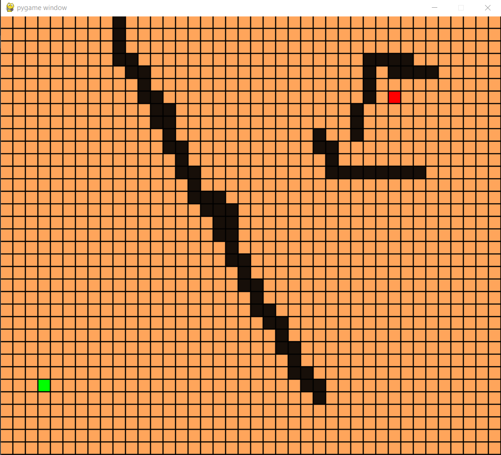
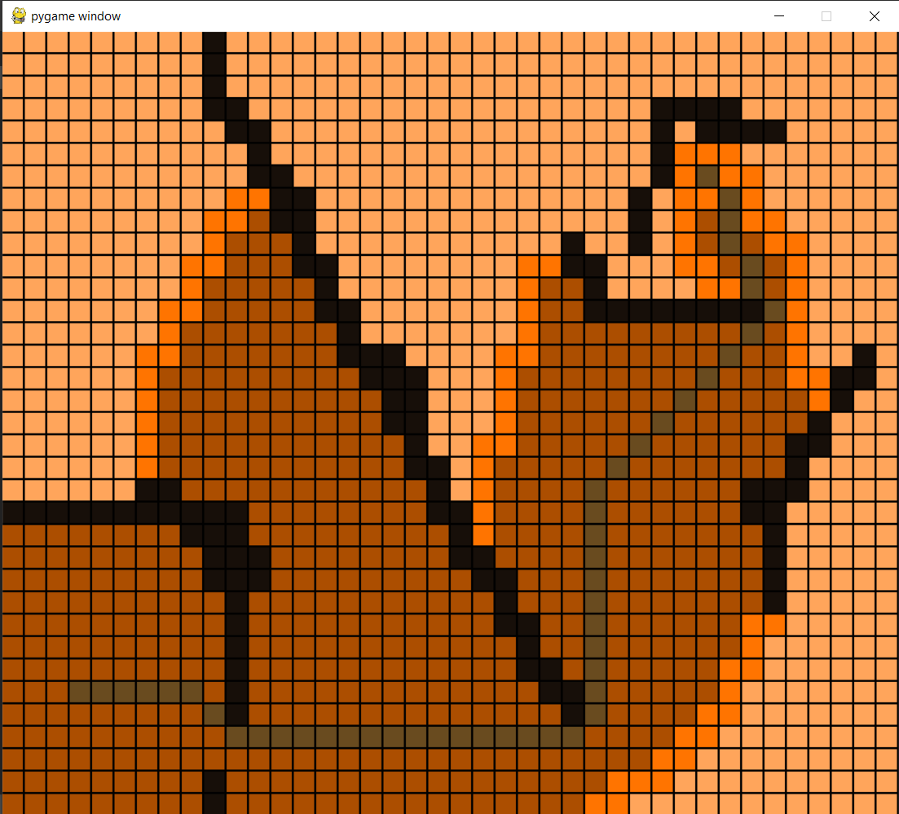

# AStar
A program visualizing the A* pathfiniding algorithm. 
The user can draw obstacles in the program that the path generated by A* has to avoid.

# Use
You can either:
* Run A_Star_Pathfinding.exe in build/exe.win32-3.8.
* Run A_Star_Pathfinding.py in the main folder (you will then have to install necessary  dependencies).

When the progam is running, a grid of boxes will appear. The following commands are used to interact with the program.

* Use the keys **e** and **s** to mark the start and end point of the path.
* Use **r** to reset the grid.
* Use right mouse button to draw obstacles.
* Use left mouse button to remove obstacles.
* Use **c** to clear the work of the algorithm, and keep the obstacles you have drawn.
* Use space to start the algorithm.
* Use arrow up to increase the delay between each step in the algorithm, and arrow down to decrease (resulting in a faster/slower visualization)

Martin Ansteensen 2020
